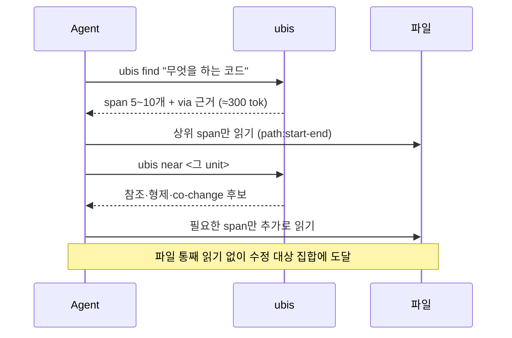
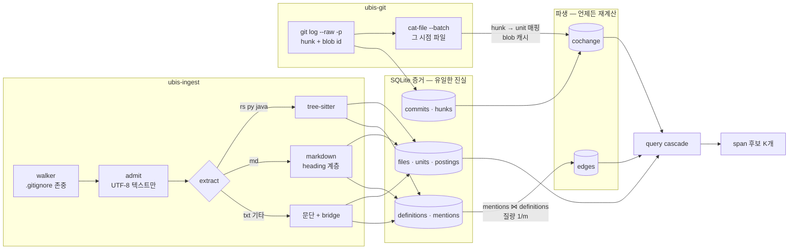
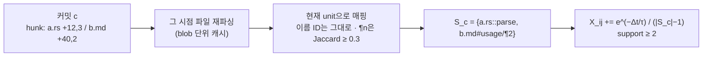
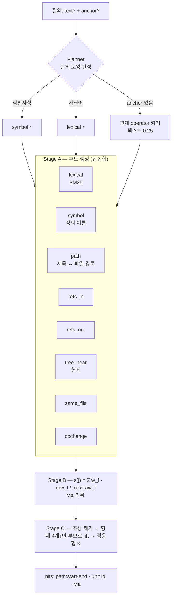
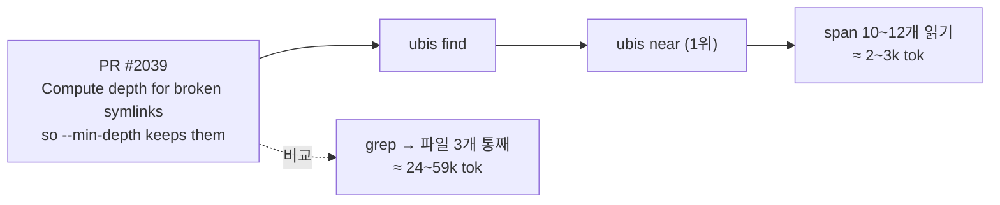
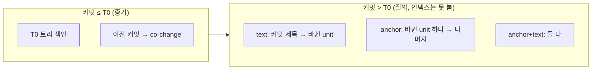

# UBIS

**Where, not what.** 에이전트에게 지도가 아니라 후보 목록을 준다.

UBIS는 내 PC의 텍스트(코드·문서)를 **unit**(함수, 메서드, 절, 문단) 단위로 색인해서, LLM 에이전트가 적은 호출과 적은 토큰으로 정확한 위치에 도달하게 하는 **결정론적 로컬 인덱스**다. 학습·LLM·신경망 임베딩을 쓰지 않는다. 같은 입력이면 비트 단위로 같은 인덱스, 같은 결과.

```text
$ ubis find "incremental index equals fresh"
[1] CLAUDE.md:56-59  CLAUDE.md#claudemd--ubis-작업-가이드/4-불변식과-테스트/¶1  (paragraph)
    via lexical 1.00
[2] crates/ubis-ingest/src/lib.rs:294-317  crates/ubis-ingest/src/lib.rs::tests::index_paths_equals_fresh  (function)
    via lexical 0.88
[3] crates/ubis-ingest/src/lib.rs:255-292  crates/ubis-ingest/src/lib.rs::tests::incremental_equals_fresh  (function)
    via lexical 0.83
```

파일이 아니라 **span**(`path:start-end`)을 돌려준다. 에이전트는 파일 전체 대신 그 줄만 읽는다.

---

## 목차

- [왜 unit인가](#왜-unit인가)
- [빠른 시작](#빠른-시작)
- [사용 예시](#사용-예시)
- [에이전트 워크플로](#에이전트-워크플로)
- [파이프라인](#파이프라인)
- [질의 cascade](#질의-cascade)
- [무엇을 색인하나](#무엇을-색인하나)
- [평가](#평가)
- [구조와 개발](#구조와-개발)

---

## 왜 unit인가

에이전트가 코드를 찾는 비용:

$$\mathbb{E}[\text{cost}] = K\cdot t_{\text{cand}} + \sum_{\text{열람}}|\text{span}| + P(\text{miss}\mid K)\cdot C_{\text{fallback}}$$

| | grep + 파일 통째 읽기 | UBIS |
|---|---|---|
| 한 번에 받는 것 | 파일 경로 | unit span 5~10개 (각 ≈ 30 tok) |
| 읽는 양 | 파일 전체 | 해당 함수·절만 |
| 놓쳤을 때 | 다음 파일 통째로 | 다음 후보 span |
| 근거 | 없음 | `via lexical / refs_in / cochange …` |

- 후보는 싸고, 놓치면 비싸다 → **precision보다 recall**.
- 정답을 맞히는 게 아니라 **1000개를 10개로 줄이는 것**이 일이다.

---

## 빠른 시작

```bash
cargo install --path crates/ubis-cli

cd ~/my-project
ubis find "토큰 만료 처리"          # 찾기
ubis near src/auth/token.rs:42     # 이 줄 주변에서 같이 봐야 할 곳
```

이게 전부다. 따로 색인할 필요가 없다.

- git 레포에서 처음 실행하면 레포 루트에 `.ubis/`를 만들고 파일과 git 이력을 색인한다. `.ubis/`는 자체 `.gitignore`를 가져서 `git status`에 뜨지 않는다.
- 이후에는 매 호출 전에 바뀐 파일만 다시 읽는다. 크기·수정 시각이 같으면 읽지 않고, 커밋이 생기면 이력을 다시 파생한다.
- git 밖의 폴더는 `ubis index <dir>`로 한 번 만들어 둔다.

| ripgrep (221 파일, 903 커밋) | 시간 |
|---|---:|
| 첫 호출 (색인 + 이력) | 4~5s |
| 이후 호출의 자동 갱신 (변경 없음) | 10~20ms |
| `find` / `near` 질의 | 10ms 안팎 |

---

## 사용 예시

### 1. 설명으로 찾기 — `find`

```bash
ubis find "adaptive cut K"
```

```text
[1] crates/ubis-core/src/query.rs:527-535  …::tests::adaptive_k_cuts_at_largest_gap  (function)
    via lexical 1.00
[3] crates/ubis-core/src/query.rs:490-494  crates/ubis-core/src/query.rs::adaptive_k  (function)
    /// Cut at the largest score drop within `[K_MIN, k_max]`, subject to keeping
    via lexical 0.97
```

식별자형 질의(`Store::open`, `rebuild_edges`)는 planner가 알아보고 `symbol` operator 가중치를 올린다.

### 2. 지금 보는 unit 주변 — `near`

```bash
# sharkdp/fd 레포에서
ubis near src/exec/job.rs::batch -k 8      # src/exec/job.rs:50 처럼 줄 번호로 줘도 된다
```

```text
[1] src/exec/job.rs:7-43  src/exec/job.rs::job  (function)
    /// An event loop that listens for inputs from the `rx` receiver. Each received input will
    via tree_near 0.30, same_file 0.20, cochange 0.50
[2] src/exec/mod.rs:90-120  src/exec/mod.rs::CommandSet::execute_batch  (method)
    pub fn execute_batch<I>(&self, paths: I, limit: usize, path_separator: Option<&str>) -> ExitCode
    via refs_out 0.80, cochange 0.10
[3] src/config.rs:13-136  src/config.rs::Config  (type)
    /// Configuration options for *fd*.
    via refs_out 0.80, cochange 0.06
[6] src/exit_codes.rs:6-12  src/exit_codes.rs::ExitCode  (type)
    via refs_out 0.80
```

anchor만 주면 이동이 된다. 이 unit을 참조하는 곳, 이 unit이 참조하는 곳, 형제 unit, 같은 파일의 다른 unit, 그리고 **과거 커밋에서 같이 바뀐 unit**이 후보로 나온다.

### 3. anchor + 설명 — `find --anchor`

```bash
ubis find --anchor Store::open "error handling"
```

anchor 신호가 주가 되고, 텍스트는 가중치 0.25로 순위를 다듬는다.

### 4. 참조 목록과 본문 — `refs`, `open`

```bash
ubis refs Store::open          # 기록된 참조 전체 (origin, 질량 포함)
ubis open Store::open          # 그 span만 출력
ubis open Store::open --out    # 한 단계 위 (부모 unit)
```

```text
# 출력 형식 (예시 경로)
call   same_file w=1.00  src/cli.rs::main  (src/cli.rs:88)  → src/store.rs::Store::open
call   global    w=0.50  src/x.rs::load    (src/x.rs:12)   → src/store.rs::Store::open
```

`global` origin은 이름으로만 추정한 참조다(같은 이름 정의가 $m$개면 질량 $1/m$). `same_file`, `explicit`은 확정 참조다.

### 5. 범위 제한, JSON

```bash
ubis find "retry backoff" --scope src/net/ -k 5
ubis find "retry backoff" --json | jq '.[0]'
```

unit은 `path:line`(`src/store.rs:120`), 전체 ID(`src/store.rs::Store::open`), 이름(`Store::open`) 중 무엇으로든 가리킬 수 있다. 이름이 여러 unit에 맞으면 후보 목록을 보여주고 멈춘다.

그 밖의 명령: `ubis index <dir>`(git 밖 폴더, 또는 명시적 전체 재계산), `ubis watch <dir>`(파일 이벤트로 계속 갱신), `ubis status`. 전역 옵션 `--json`, `--no-refresh`.

---

## 에이전트 워크플로

[`integrations/skills/ubis/SKILL.md`](integrations/skills/ubis/SKILL.md)를 에이전트 스킬로 등록하면 아래 흐름으로 쓴다.



---

## 파이프라인



원칙:

1. **Evidence만 원천.** 파서가 본 원본(unit, 정의, mention, hunk)만 저장한다. 엣지와 co-change는 파생물이라 정의가 바뀌어도 낡은 엣지가 남지 않는다.
2. **파일 단위 교체.** 파일 하나가 바뀌면 그 파일의 행만 한 트랜잭션으로 바꾼다. `증분 색인 == 처음부터 색인`을 테스트로 보장한다.
3. **모호함은 질량으로.** 같은 이름 정의가 $m$개면 각 $1/m$. 버리지 않되 `origin`으로 추정임을 표시한다.

### Unit 트리

```text
src/store.rs                               (file)
├── src/store.rs/~1                        (gap: use 문)
├── src/store.rs::Store                    (type)
│   └── src/store.rs::Store::open          (method)   ← ID는 구조 경로, 줄 번호는 속성
└── src/store.rs::tests
    └── src/store.rs::tests::roundtrip     (function)

docs/guide.md                              (file)
└── docs/guide.md#install                  (heading, GitHub anchor)
    ├── docs/guide.md#install/¶1           (paragraph)
    └── docs/guide.md#install/code1        (code block)
```

색인은 leaf만 한다. 이름 있는 자식이 덮지 않는 줄은 gap leaf가 되므로 비어 있지 않은 모든 줄이 정확히 하나의 leaf에 속한다.

### co-change: 이력에서 배우는 "같이 바뀌는 곳"



$$X_{ij}=\sum_{c:\,i,j\in S_c} \frac{e^{-(T-t_c)/\tau}}{|S_c|-1},\qquad \tau = 365\text{일}$$

오래된 커밋일수록 약하고, 큰 커밋일수록 쌍마다 희석된다. 두 번 이상 같이 바뀐 쌍만 남긴다.

---

## 질의 cascade



| Operator | 신호 | 기본 가중치 |
|---|---|---|
| `lexical` | BM25 (코드 subword 분리, 한글 bigram) | 1.0 / anchor 있으면 0.25 |
| `symbol` | 정의 이름 정확 일치, $1/n$ | 식별자형 1.2 / 자연어 0.3 / anchor 0.25 |
| `path` | 제목 term ↔ 파일 경로 토큰 (IDF), 그 파일의 매칭 leaf | lexical × 0.5 |
| `refs_in` · `refs_out` | anchor로 들어오는/나가는 엣지 질량 | 0.8 |
| `tree_near` | 형제, $1/(1+d)$ | 0.3 |
| `same_file` | 같은 파일 leaf, $1/(1+d/4)$ | 0.2 |
| `cochange` | 과거 co-change 질량 | 0.5 |

**적응형 K**: $K\in[5, K_{\max}]$에서 점수 낙차가 가장 큰 지점에서 자른다. 단 상위 질량의 50% 이상을 유지하고, 동률이면 큰 $K$를 고른다(점수가 평평하면 순위가 불확실하므로 더 보여주는 쪽이 싼 실수).

---

## 무엇을 색인하나

| 포맷 | unit | 정의 | mention |
|---|---|---|---|
| Rust, Python, Java (tree-sitter) | 모듈 › 타입/impl/클래스 › 함수/메서드, 남는 줄은 gap | 심볼 (+ `Owner::method`) | 호출, 타입 참조, import |
| Markdown | heading 계층 › 문단 / 코드 블록 | GitHub식 anchor | `[t](#a)`, `[t](x.md#a)`, `[[wiki]]`, 문장 속 식별자 |
| 텍스트 (`.txt`, `.tex`, `.rst`, 기타 코드) | 문단 | 파일 | 문장 속 식별자 |
| git 이력 (git 레포면 자동) | — | — | 커밋 hunk → co-change |

읽을 수 있는 UTF-8 텍스트만 받는다. 바이너리·이미지·Office·PDF는 제외한다.

---

## 평가

### 실제 작업: "이 PR을 구현하라"

병합된 GitHub PR을 그대로 태스크로 쓴다. 에이전트가 받는 것 = **PR 제목 + 본문**. 색인 = PR 직전 트리. 정답 = PR이 실제로 바꾼 unit.



| 코퍼스 (태스크 수) | grep → 파일 3개 읽기 | **ubis find→near** | 토큰 비율 |
|---|---:|---:|---:|
| sharkdp/fd (67) | 0.373 / 24,304 tok | **0.385** / 2,940 tok | 1/8 |
| BurntSushi/ripgrep (178) | 0.250 / 59,062 tok | **0.287** / 3,394 tok | 1/17 |
| psf/requests (114) | 0.278 / 41,214 tok | **0.345** / 1,908 tok | 1/22 |
| pallets/flask (140) | 0.327 / 35,673 tok | 0.309 / 2,101 tok | 1/17 |

recall = PR이 바꾼 unit 중 찾은 비율. 네 개 중 세 코퍼스에서 grep+파일 읽기보다 많이 찾으면서 토큰은 1/8~1/22.

```bash
python3 crates/ubis-bench/scripts/fetch_pr_tasks.py sharkdp/fd path/to/fd tasks.jsonl   # gh 필요
ubis-bench path/to/fd --tasks tasks.jsonl --max-commits 900
```

**Dogfooding** (UBIS 자신): 이 레포에서 한 실제 수정 5건을 수정 전 트리에 작업 설명으로 물었을 때, `find` 1 call로 2건, `find → near` 2 call로 4건의 실제 수정 위치에 도달했다. 실패 1건은 설명 어휘와 코드 어휘가 달랐던 경우(자세한 표는 REPORT.md).

### 시간 분할 (커밋 이력)

git은 증거이자 채점자라서 **시간으로 자른다**.



anchor 모드 recall / 읽은 토큰 — 커밋 하나가 바꾼 unit 중 하나를 주고 나머지를 찾기 (전체 표와 재현 명령은 [REPORT.md](REPORT.md)):

| 코퍼스 | 파일 통째 읽기 | UBIS (co-change 전) | UBIS + co-change |
|---|---:|---:|---:|
| sharkdp/fd | 0.437 / 3191 | 0.351 / 1135 | **0.470** / 1760 |
| psf/requests | 0.464 / 5254 | 0.236 / 1034 | **0.286** / 1094 |
| BurntSushi/ripgrep | 0.327 / 12047 | 0.090 / 2034 | **0.253** / 4412 |
| pallets/flask | 0.604 / 3778 | 0.374 / 2519 | 0.368 / 2650 |

```bash
ubis-bench path/to/repo --holdout 200 --max-commits 900            # 기본 plan
ubis-bench path/to/repo --disable cochange                         # ablation
ubis-bench path/to/repo --tasks tasks.jsonl                        # PR 태스크 모드
ubis-bench path/to/repo --weight lexical=0.5 --k-min 10 -v         # 가중치, 컷, 질의별 출력
```

새 operator·가중치는 **두 개 이상 코퍼스**에서 recall 또는 토큰에서 이겨야 기본 plan에 들어간다. 나쁜 결과도 REPORT.md에 남긴다.

---

## 구조와 개발

```text
crates/
  ubis-core    unit 모델, SQLite 증거 저장소, resolver, co-change, 질의 cascade, 토크나이저
  ubis-ingest  텍스트 판별, extractor(code/markdown/text), 증분 인덱서, 이력 → unit 매핑
  ubis-git     log 파싱(hunk + blob), cat-file --batch 리더, archive
  ubis-cli     ubis
  ubis-bench   시간 분할 평가 하네스
integrations/skills/ubis/SKILL.md   에이전트 스킬
```

```bash
cargo test --workspace
cargo clippy --workspace --all-targets -- -D warnings
```

- 새 포맷 → `ubis-ingest`에 extractor 추가 (`UnitTree`를 쓰면 gap·ID 규칙이 맞춰진다)
- 새 신호 → `impl Operator` + `plan()`에 가중치 등록 → `ubis-bench`로 측정

설계는 [DESIGN.md](DESIGN.md), 측정값은 [REPORT.md](REPORT.md), 작업 원칙은 [CLAUDE.md](CLAUDE.md).

라이선스: MIT OR Apache-2.0
