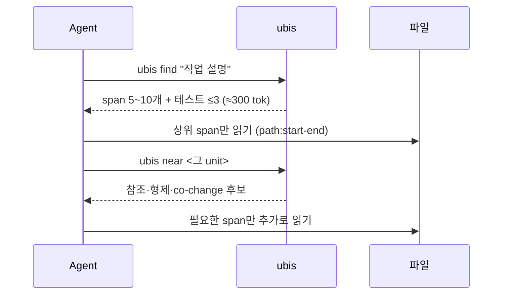
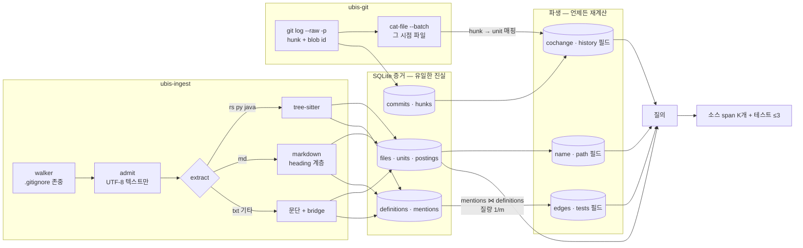

# UBIS

**작업 설명 하나로, 1k 토큰 안에 고칠 함수의 위치를 알려주는 로컬 인덱스.** 모델·서버·API 없이 결정론적으로 돈다. SWE-bench에서 같은 출력 1k 토큰으로 Aider repo map보다 정답 함수를 9배 많이 짚고, 실제 GitHub PR 작업에서 "grep 후 파일 3개 읽기"보다 많이 찾으면서 토큰은 1/7~1/13만 쓴다.

```text
$ ubis find "exec batch should respect the path separator option"      # sharkdp/fd
src/filesystem.rs:123-136 default_path_separator · code history name
  /// Default value for the path_separator, mainly for MSYS/MSYS2, which set the MSYSTEM
src/exec/mod.rs:90-120 CommandSet::execute_batch · history code name path tests
  pub fn execute_batch<I>(&self, paths: I, limit: usize, path_separator: Option<&str>) -> ExitCode
...
tests:
tests/tests.rs:2313-2395 test_exec_with_separator · code history name tests
  /// Shell script execution (--exec) with a custom --path-separator
```

## 핵심

LLM 에이전트가 코드를 찾는 비용은 대부분 **읽는 양**이다. grep은 파일을 가리키고, 에이전트는 파일을 통째로 읽는다. UBIS는 에이전트의 총비용을 줄이려고 만들었다.

$$\mathbb{E}[\text{cost}] = \underbrace{K\cdot t_{\text{cand}}}_{\text{목록}} + \underbrace{\textstyle\sum|\text{span}|}_{\text{읽기}} + \underbrace{P(\text{miss})\cdot C_{\text{fallback}}}_{\text{놓치면 grep+파일 통째}}$$

**1. 파일이 아니라 unit.** 함수·메서드·타입·절·문단을 tree-sitter로 잘라 검색 단위로 쓴다. 결과는 `path:start-end` span이고, 에이전트는 그 줄만 읽는다.

**2. unit을 여러 방향에서 본 텍스트를 색인한다.** 모두 저장된 증거에서 파생된다.

| 필드 | 무엇 | 왜 |
|---|---|---|
| `code` | 본문 | 코드가 하는 말 |
| `name` | 식별자 + 파일명 | 이름으로 불릴 때 |
| `path` | 경로 단어 | 모듈로 불릴 때 |
| `history` | 이 unit을 바꾼 커밋 메시지 | 작업 설명은 코드보다 커밋 메시지를 닮았다 |
| `tests` (파일 단위) | 테스트가 이 파일의 이름을 부르는 줄 | 테스트는 파일의 기대 동작을 설명한다 |

**3. 점수는 bit의 합이다.** 필드마다 DPH(Divergence From Randomness)로 "이 단어가 이 unit에 우연보다 얼마나 몰려 있나"를 bit로 재고, 필드끼리 더한다. 독립된 증거의 정보량은 더해지므로 **필드 가중치도, 튜닝할 파라미터도 없다.** 테스트 unit은 정답을 밀어내므로 `tests:` 목록으로 따로 준다.

**4. 기본값은 측정이 정한다.** 이 구성은 SWE-bench에서 레포를 dev/held-out으로 나눠 골랐다. 질의 확장, 그래프 확산, 확률 보정, 계층 softmax, 호출 관계의 unit 단위 전파(이름 매칭이든 정확한 해석이든) 같은 대안은 모두 측정에서 져서 버렸다. 학습·LLM·임베딩은 쓰지 않는다. 전 과정은 [REPORT.md](REPORT.md).

### 효과

**같은 출력 예산에서 정답 위치를 짚는 비율** (SWE-bench dev 121 태스크, 정답 = 이슈를 고친 패치가 바꾼 함수):

| 도구 출력 | UBIS 정답 함수 / 파일 | Aider repo map 정답 함수 / 파일 |
|---|---:|---:|
| 1k 토큰 | **.638 / .834** | .068 / .362 |
| 2k 토큰 | **.719 / .890** | .105 / .499 |
| 8k 토큰 (Aider 기본) | .741 / .898 | .314 / .864 |

Aider는 정의-참조 그래프의 PageRank로 순위를 매기고 질의는 식별자·파일명 일치로만 들어간다. UBIS는 이슈의 모든 단어를 필드별로 대조하고, 한 unit을 두 줄로 보여준다. (Aider map은 원래 저장소 전체를 LLM에게 보여주는 지도다. 이 표는 "작업에 필요한 위치 찾기"라는 한 측면의 비교다.)

**held-out 레포** (SWE-bench Lite, django·sympy·scikit-learn·matplotlib·sphinx·astropy 243 태스크, 개발 중 한 번도 보지 않음):

| | 정답 파일 top-1 | top-5 | 정답 함수 top-10 |
|---|---:|---:|---:|
| BM25 | .235 | .469 | .264 |
| **UBIS** | **.519** | **.794** | **.530** |

**실제 GitHub PR 작업** (질의 = PR 제목·본문, 색인 = PR 직전 트리, 정답 = PR이 바꾼 unit; recall / 총 토큰):

| 레포 (태스크) | grep → 파일 3개 읽기 | **`ubis find`** (1 call) | **`find → near`** (2 calls) |
|---|---:|---:|---:|
| sharkdp/fd (107) | .403 / 22,231 | **.471** / 3,161 | **.519** / 4,613 |
| BurntSushi/ripgrep (188) | .255 / 58,047 | **.505** / 4,742 | **.537** / 6,849 |
| psf/requests (186) | .281 / 39,814 | **.423** / 3,072 | **.453** / 4,373 |
| pallets/flask (219) | .326 / 36,589 | **.348** / 2,926 | **.375** / 4,525 |

총 토큰 = ubis 출력 + 돌려준 span(테스트 목록 포함)을 모두 읽는 양.

### 써보기

```bash
cargo install --path crates/ubis-cli
ubis find "<작업 설명이나 이슈>"       # 읽을 곳
ubis near src/walk.rs:620             # 이 줄을 고치면 같이 볼 곳
```

알아야 할 건 이 두 명령뿐이다. 첫 호출이 색인을 만들고, 이후에는 호출마다 알아서 갱신한다. 에이전트용 스킬은 [`SKILL.md`](integrations/skills/ubis/SKILL.md) 한 장이다.

---

## 목차

- [빠른 시작](#빠른-시작)
- [사용 예시](#사용-예시)
- [에이전트 워크플로](#에이전트-워크플로)
- [파이프라인](#파이프라인)
- [질의](#질의)
- [무엇을 색인하나](#무엇을-색인하나)
- [평가](#평가)
- [구조와 개발](#구조와-개발)

---

## 빠른 시작

```bash
cargo install --path crates/ubis-cli

cd ~/my-project
ubis find "토큰 만료 처리"          # 찾기
ubis near src/auth/token.rs:42     # 이 줄 주변에서 같이 봐야 할 곳
```

따로 색인할 필요가 없다.

- git 레포에서 처음 실행하면 레포 루트에 `.ubis/`를 만들고 파일과 git 이력을 색인한다. `.ubis/`는 자체 `.gitignore`를 가져서 `git status`에 뜨지 않는다.
- 이후에는 매 호출 전에 바뀐 파일만 다시 읽는다. 크기·수정 시각이 같으면 읽지 않고, 커밋이 생기면 이력을 다시 파생한다.
- git 밖의 폴더는 `ubis index <dir>`로 한 번 만들어 둔다.

| sharkdp/fd (이력 포함) | 시간 |
|---|---:|
| 첫 색인 | 약 2s |
| `find` 질의 | 수십 ms |

---

## 사용 예시

### 1. 설명으로 찾기 — `find`

```text
$ ubis find "min-depth broken symlink"          # sharkdp/fd
src/dir_entry.rs:26-112 impl DirEntry (+6 inside) · history code name tests
  impl DirEntry {
src/walk.rs:655-668 is_broken_symlink · history code name tests
  /// Whether a walk error is really a broken symlink rather than a failure worth
...
tests:
tests/tests.rs:1211-1246 test_min_depth_broken_symlink · code history name tests
  /// Minimum depth with a broken symlink (regression test for #1017)
```

후보마다 두 줄이다: 읽을 위치(`path:start-end`, 그대로 `near`의 인자가 된다)와 이름, 근거가 된 필드(`via`), 그리고 한 줄 시그니처. 같은 부모의 형제가 여럿 걸리면 부모 하나로 묶는다(`+6 inside`). 테스트는 `tests:` 아래 최대 3개.

### 2. 지금 보는 unit 주변 — `near`

```bash
ubis near src/exec/job.rs::batch -k 8      # src/exec/job.rs:50 처럼 줄 번호로 줘도 된다
```

이 unit을 참조하는 곳, 이 unit이 참조하는 곳, 형제, 같은 파일의 다른 unit, **과거 커밋에서 같이 바뀐 unit**이 후보로 나온다.

### 3. anchor + 설명 — `find --anchor`

```bash
ubis find --anchor Store::open "error handling"
```

anchor 신호가 주가 되고, 텍스트 점수는 최대값으로 스케일해 0.25로 섞는다.

### 4. 참조와 본문 — `refs`, `open`

```bash
ubis refs Store::open          # 기록된 참조 전체 (origin, 질량 포함)
ubis open Store::open          # 그 span만 출력
ubis open Store::open --out    # 한 단계 위 (부모 unit)
```

`global` origin은 이름으로만 추정한 참조다(같은 이름 정의가 $m$개면 질량 $1/m$). `same_file`, `explicit`은 확정 참조다.

### 5. 범위 제한, JSON

```bash
ubis find "retry backoff" --scope src/net/ -k 5
ubis find "retry backoff" --json | jq '.hits[0]'     # {"hits": [...], "tests": [...]}
```

unit은 `path:line`, 전체 ID(`src/store.rs::Store::open`), 이름(`Store::open`) 중 무엇으로든 가리킬 수 있다. 그 밖의 명령: `ubis index <dir>`, `ubis watch <dir>`, `ubis status`. 전역 옵션 `--json`, `--no-refresh`.

---

## 에이전트 워크플로



---

## 파이프라인



원칙:

1. **Evidence만 원천.** 파서가 본 원본(unit, 정의, mention, hunk)만 저장한다. 엣지, co-change, 파생 필드는 언제든 다시 계산할 수 있다.
2. **파일 단위 교체.** 파일 하나가 바뀌면 그 파일의 행만 한 트랜잭션으로 바꾼다. `증분 색인 == 처음부터 색인`을 테스트로 보장한다.
3. **모호함은 질량으로.** 같은 이름 정의가 $m$개면 각 $1/m$. 버리지 않되 `origin`으로 추정임을 표시한다.

### Unit 트리

```text
src/store.rs                               (file)
├── src/store.rs/~1                        (gap: use 문)
├── src/store.rs::Store                    (type)
│   └── src/store.rs::Store::open          (method)   ← ID는 구조 경로, 줄 번호는 속성
└── src/store.rs::tests
    └── src/store.rs::tests::roundtrip     (function)

docs/guide.md                              (file)
└── docs/guide.md#install                  (heading, GitHub anchor)
    ├── docs/guide.md#install/¶1           (paragraph)
    └── docs/guide.md#install/code1        (code block)
```

색인은 leaf만 한다. 이름 있는 자식이 덮지 않는 줄은 gap leaf가 되므로 비어 있지 않은 모든 줄이 정확히 하나의 leaf에 속한다.

---

## 질의

### 텍스트: 필드별 DPH bit의 합

$$s(j) = \sum_{f\in\{\text{code},\,\text{name},\,\text{path},\,\text{history}\}} \text{DPH}_f(q, j) \;+\; \text{DPH}_{\text{tests}}(q, \text{file}(j))$$

$$\text{DPH}(t,d) = \frac{(1-f)^2}{tf+1}\Big(tf\log_2\frac{tf\cdot\bar{l}}{l}\cdot\frac{N}{F_t} + \tfrac12\log_2\big(2\pi\, tf\,(1-f)\big)\Big),\quad f=\frac{tf}{l}$$

- 질의어 가중치: $1+\ln(\text{반복 수})$, 첫 줄(제목)에 있으면 ×1.5.
- 토큰: 코드 식별자 분리(`HnswIndex` → `hnswindex hnsw index`), 영어 어간을 원형과 함께, 한글 bigram.
- 테스트 경로(`tests/`, `test_*.py`, `*_test.go`, `*.test.ts`, Rust `mod tests`)의 unit은 `tests:` 목록으로.
- 형제 4개 이상이 걸리면 부모로 묶고, 점수 낙차가 가장 큰 곳에서 5~10개로 자른다.

### anchor: 관계 operator

| Operator | 신호 | 가중치 |
|---|---|---|
| `text` | 위 텍스트 점수 (최대값으로 스케일) | 0.25 |
| `refs_in` · `refs_out` | anchor로 들어오는/나가는 엣지 질량 | 0.8 |
| `tree_near` | 형제, $1/(1+d)$ | 0.3 |
| `same_file` | 같은 파일 leaf, $1/(1+d/4)$ | 0.2 |
| `cochange` | 과거 co-change, $\sum_c e^{-\Delta t/\tau}/(\lvert S_c\rvert-1)$, $\tau$=365일 | 0.5 |

---

## 무엇을 색인하나

| 포맷 | unit | 정의 | mention |
|---|---|---|---|
| Rust, Python, Java (tree-sitter) | 모듈 › 타입/impl/클래스 › 함수/메서드, 남는 줄은 gap | 심볼 (+ `Owner::method`) | 호출, 타입 참조, import |
| Markdown | heading 계층 › 문단 / 코드 블록 | GitHub식 anchor | `[t](#a)`, `[t](x.md#a)`, `[[wiki]]`, 문장 속 식별자 |
| 텍스트 (`.txt`, `.tex`, `.rst`, 기타 코드) | 문단 | 파일 | 문장 속 식별자 |
| git 이력 (git 레포면 자동) | — | — | 커밋 hunk → co-change, history 필드 |

읽을 수 있는 UTF-8 텍스트만 받는다. 바이너리·이미지·Office·PDF는 제외한다.

---

## 평가

세 가지로 잰다. 전체 표와 재현 명령은 [REPORT.md](REPORT.md) E13.

**1. SWE-bench (모델 선택).** 12개 레포를 dev 6개(pytest, requests, pylint, xarray, seaborn, flask)와 held-out 6개로 나눴다. 모든 선택은 dev에서 했고, held-out은 고정된 모델로 한 번씩만 봤다. 정답 = 패치가 바꾼 줄을 담은 가장 작은 unit(테스트 제외). 이력은 이슈 작성 시각 이전 커밋만 쓴다. 실험 코드와 기록은 별도 lab(UBIS-V2)에 있다.

**2. 실제 PR 작업 (이 레포의 하네스).** 병합된 GitHub PR을 태스크로 쓴다. 이력은 PR 생성 시각 이전만 증거로 쓴다.

```bash
python3 crates/ubis-bench/scripts/fetch_pr_tasks.py sharkdp/fd path/to/fd tasks.jsonl   # gh 필요
ubis-bench path/to/fd --tasks tasks.jsonl --max-commits 900
ubis-bench path/to/fd --tasks tasks.jsonl -k 30 --k-min 30 --budget 2000 --gold-code    # 같은 읽기 예산, 코드 정답만
```

같은 읽기 예산에서 v0.5(BM25 + operator 가중치)와 비교, 코드 정답 기준 recall:

| 예산 | fd | ripgrep | requests | flask |
|---|---|---|---|---|
| 1k | .241 → **.321** | .156 → **.340** | .234 → .231 | .207 → **.245** |
| 2k | .379 → **.437** | .201 → **.379** | .299 → .314 | .236 → **.335** |
| 4k | .462 → **.554** | .276 → **.488** | .392 → .397 | .329 → **.435** |

변경 기록 문단(CHANGES.rst 등)까지 정답으로 세면 flask·requests에서는 짧은 문단을 싸게 맞히는 v0.5가 약간 앞선다.

**3. 다른 도구와.** Aider repo map(위 표), grep → 파일 읽기(위 표). 신경망 기반 도구와는 비교하지 않았다.

새 필드·신호는 두 개 이상 코퍼스에서 recall 또는 토큰에서 이겨야 기본에 들어간다. 나쁜 결과도 REPORT.md에 남긴다.

---

## 구조와 개발

```text
crates/
  ubis-core    unit 모델, SQLite 증거 저장소, 검색 필드와 DPH, resolver, co-change, 질의
  ubis-ingest  텍스트 판별, extractor(code/markdown/text), 증분 인덱서, 이력 → unit 매핑
  ubis-git     log 파싱(hunk + blob), cat-file --batch 리더, archive
  ubis-cli     ubis
  ubis-bench   평가 하네스 (시간 분할, PR 태스크), ubis-rank (외부 평가용 순위)
integrations/skills/ubis/SKILL.md   에이전트 스킬
```

```bash
cargo test --workspace
cargo clippy --workspace --all-targets -- -D warnings
```

- 새 포맷 → `ubis-ingest`에 extractor 추가 (`UnitTree`를 쓰면 gap·ID 규칙이 맞춰진다)
- 새 필드 → `fields.rs`에 파생 규칙, `Text`의 필드 목록에 추가 → `ubis-bench`로 측정

설계는 [DESIGN.md](DESIGN.md), 측정값은 [REPORT.md](REPORT.md), 작업 원칙은 [CLAUDE.md](CLAUDE.md).

라이선스: MIT OR Apache-2.0
